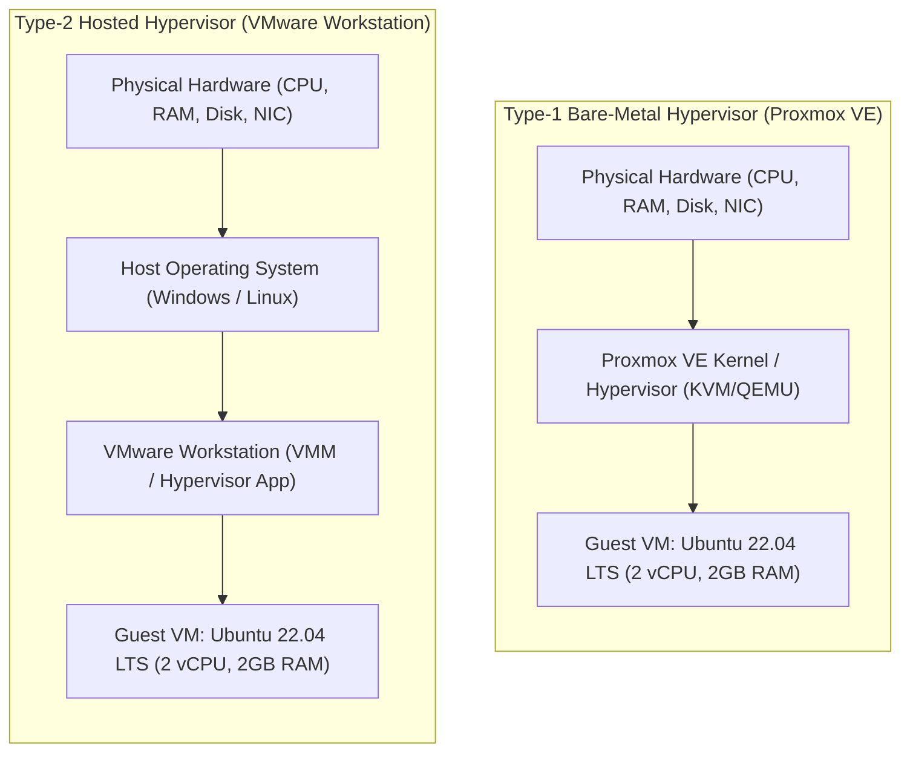
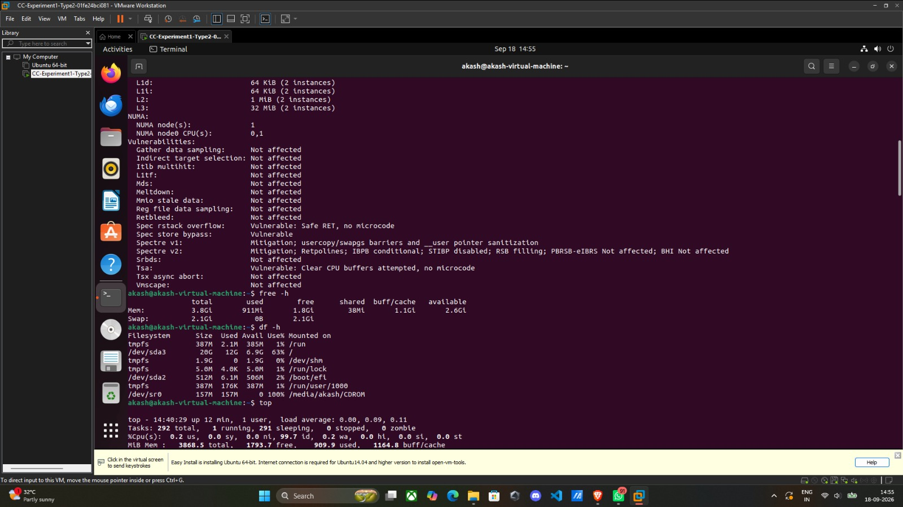
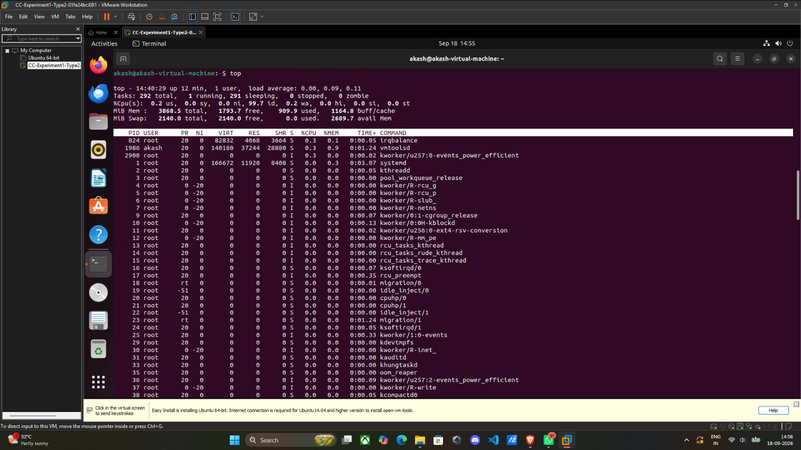
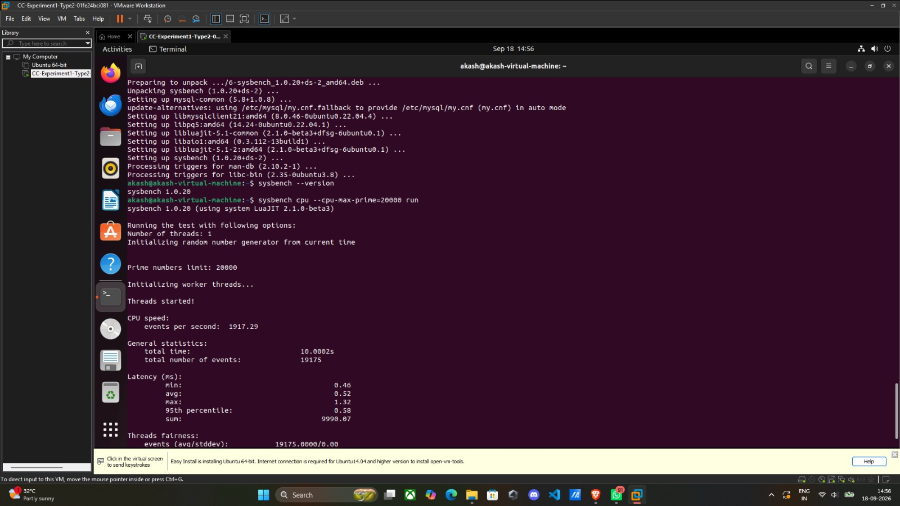
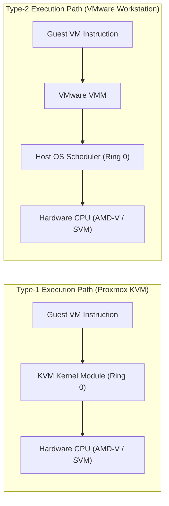

# Performance Analysis: Type-1 (Proxmox VE) vs Type-2 (VMware Workstation) Hypervisors


-E57000?logo=proxmox&logoColor=white)
-607078?logo=vmware&logoColor=white)


---

## 📑 Table of Contents

- [Executive Summary](#-executive-summary)
- [Architectural Comparison: Type-1 vs Type-2 Hypervisors](#-architectural-comparison-type-1-vs-type-2-hypervisors)
- [Test Environment & System Specifications](#-test-environment--system-specifications)
- [Part A: Implementation on Type-1 Hypervisor (Proxmox VE)](#-part-a-implementation-on-type-1-hypervisor-proxmox-ve)
  - [1. Accessing Proxmox VE Web GUI](#1-accessing-proxmox-ve-web-gui)
  - [2. SSL Certificate Handling & Authentication](#2-ssl-certificate-handling--authentication)
  - [3. Proxmox Hierarchy & Navigation](#3-proxmox-hierarchy--navigation)
  - [4. Creating the Virtual Machine](#4-creating-the-virtual-machine)
  - [5. Starting VM & Opening Console](#5-starting-vm--opening-console)
  - [6. Ubuntu OS Installation](#6-ubuntu-os-installation)
  - [7. System Verification & Resource Inspection](#7-system-verification--resource-inspection)
  - [8. Sysbench Installation & CPU Benchmark Execution](#8-sysbench-installation--cpu-benchmark-execution)
  - [9. Proxmox Resource Monitoring & Observation](#9-proxmox-resource-monitoring--observation)
  - [10. Graceful VM Shutdown](#10-graceful-vm-shutdown)
- [Part B: Implementation on Type-2 Hypervisor (VMware Workstation)](#-part-b-implementation-on-type-2-hypervisor-vmware-workstation)
  - [1. Launching VMware Workstation Wizard](#1-launching-vmware-workstation-wizard)
  - [2. Installation Media & Guest OS Selection](#2-installation-media--guest-os-selection)
  - [3. VM Naming & Disk Configuration](#3-vm-naming--disk-configuration)
  - [4. Hardware Customization](#4-hardware-customization)
  - [5. Ubuntu Operating System Installation](#5-ubuntu-operating-system-installation)
  - [6. Post-Installation System Verification](#6-post-installation-system-verification)
  - [7. Sysbench Installation](#7-sysbench-installation)
  - [8. Executing the Sysbench CPU Benchmark](#8-executing-the-sysbench-cpu-benchmark)
  - [9. Resource Monitoring & Graceful Shutdown](#9-resource-monitoring--graceful-shutdown)
- [Empirical Results & Observation Tables](#-empirical-results--observation-tables)
  - [Type-2 Hypervisor (VMware Workstation) Results](#type-2-hypervisor-vmware-workstation-results)
  - [Comparative Analysis Table](#comparative-analysis-table)
- [Technical Discussion: Virtualization Overhead](#-technical-discussion-virtualization-overhead)
- [Summary Workflows](#-summary-workflows)
- [Conclusion](#-conclusion)

---

## 📌 Executive Summary

This laboratory experiment evaluates virtualization overhead and compute efficiency between:
1. **Type-1 Bare-Metal Hypervisor:** **Proxmox Virtual Environment (PVE)**, running directly on physical hardware without a host operating system.
2. **Type-2 Hosted Hypervisor:** **VMware Workstation**, running as an application on top of an existing host operating system.

Identical Ubuntu guest virtual machines (2 vCPUs, 2 GB RAM, 20 GB Virtual Disk) were provisioned on both hypervisors. CPU performance was empirically analyzed under an identical CPU-intensive workload using **Sysbench** (prime number calculation up to 20,000) to isolate and measure virtualization layer latency, scheduling penalties, and computation throughput.

---

## 🏛 Architectural Comparison: Type-1 vs Type-2 Hypervisors

Virtualization architectures differ fundamentally in where the hypervisor sits in relation to the physical hardware:



| Architectural Factor | Type-1 Hypervisor (Proxmox VE) | Type-2 Hypervisor (VMware Workstation) |
| :--- | :--- | :--- |
| **Placement** | Bare metal directly on physical hardware | Application layer on top of host OS |
| **Host OS Dependency** | None (Linux-based KVM appliance) | Depends entirely on host OS kernel and scheduler |
| **I/O & Scheduling Overhead** | Ultra-low direct hardware abstraction | Higher overhead due to dual-kernel context switches |
| **Resource Efficiency** | High; near bare-metal performance | Lower; host OS consumes significant resources |
| **Use Case** | Data centers, private clouds, enterprise servers | Software testing, desktop development, education |

---

## ⚙ Test Environment & System Specifications

To ensure a fair and scientifically rigorous benchmark, virtual machines on both platforms were configured with identical resource quotas.

### Virtual Machine Configuration (Per Hypervisor)

| Resource Parameter | Allocated Specification | Notes |
| :--- | :--- | :--- |
| **Guest OS** | Ubuntu 22.04 LTS (64-bit) | Linux kernel 6.8.x |
| **vCPU Sockets / Cores** | 1 Socket, 2 Cores (2 vCPUs total) | Symmetrical multi-processing (SMP) |
| **Virtual Memory (RAM)** | 2048 MB (2 GB) | Fixed memory allocation |
| **Virtual Hard Disk** | 20 GB | Single virtual disk image |
| **Networking** | Bridged (`vmbr0`) on Proxmox / NAT on VMware | Outbound Internet connectivity |
| **Benchmark Tool** | `sysbench 1.0.20` | LuaJIT runtime engine |
| **Workload Profile** | CPU prime calculation (`--cpu-max-prime=20000`) | Single-threaded compute stress test |

### Host Platform (Reference)
* **Processor:** AMD Ryzen 7 7735HS with Radeon Graphics (8 Cores, 16 Threads, 3.2 GHz base, up to 4.75 GHz boost)
* **Instruction Set & Virtualization:** x86_64, AMD-V (SVM), nested paging (NPT)

---

## 🖥 Part A: Implementation on Type-1 Hypervisor (Proxmox VE)

Proxmox VE is deployed as a bare-metal hypervisor integrating KVM for full virtualization and LXC for containers.

### 1. Accessing Proxmox VE Web GUI
1. Connect the management workstation to the network where the Proxmox VE server is reachable.
2. Open a modern web browser and navigate to the default HTTPS management port `8006`:
   ```
   https://<PROXMOX_SERVER_IP>:8006
   ```
   *Example:* `https://192.168.1.100:8006`

### 2. SSL Certificate Handling & Authentication
1. Because Proxmox generates a self-signed SSL certificate upon initial installation, the browser will display a certificate warning.
2. Click **Advanced** and select **Proceed to `<Server IP>` (unsafe)**.
3. On the login screen, enter the administrative credentials:

| Parameter | Configuration |
| :--- | :--- |
| **Username** | `root` (or assigned administrator) |
| **Password** | Server administrator password |
| **Realm** | Linux PAM standard authentication |
| **Language** | English (or preferred) |

4. Click **Login** to open the main management dashboard.

### 3. Proxmox Hierarchy & Navigation
The left-hand navigation pane displays the datacenter hierarchy:
```text
Datacenter
└── pve (Node)
    ├── local (ISO images, templates, VZDump backups)
    └── local-lvm (VM Disks, Container volumes)
```

### 4. Creating the Virtual Machine
Click the **Create VM** button in the top-right corner to initiate the 8-stage configuration wizard:

#### Stage 1: General Settings
| Parameter | Value / Configuration |
| :--- | :--- |
| **Node** | Target Proxmox node (e.g., `pve`) |
| **VM ID** | Automatically assigned next available ID (e.g., `100`) |
| **Name** | `CC-Experiment1-Type1` |

#### Stage 2: OS Settings
| Parameter | Value / Configuration |
| :--- | :--- |
| **Installation Media** | Use CD/DVD disc image file (ISO) |
| **Storage** | `local` |
| **ISO Image** | `ubuntu-22.04-live-server-amd64.iso` or desktop ISO |
| **Guest OS Type** | Linux (Kernel 6.x - 2.6 Kernel) |

#### Stage 3: System Settings
| Parameter | Value / Configuration |
| :--- | :--- |
| **Graphic Card** | Default |
| **SCSI Controller** | VirtIO SCSI |
| **BIOS** | Default (SeaBIOS) |
| **Qemu Agent** | Enabled (optional, recommended) |

#### Stage 4: Disks Settings
| Parameter | Value / Configuration |
| :--- | :--- |
| **Bus/Device** | SCSI (0) |
| **Storage** | `local-lvm` |
| **Disk Size** | `20 GB` |
| **Cache** | Default (No cache) |

#### Stage 5: CPU Allocation
| Parameter | Value / Configuration |
| :--- | :--- |
| **Sockets** | `1` |
| **Cores** | `2` |
| **Total vCPUs** | `2` |
| **Type** | `kvm64` or `host` |

#### Stage 6: Memory Allocation
| Parameter | Value / Configuration |
| :--- | :--- |
| **Memory (MiB)** | `2048` (2 GB RAM) |
| **Ballooning** | Enabled (default) |

#### Stage 7: Network Settings
| Parameter | Value / Configuration |
| :--- | :--- |
| **Bridge** | `vmbr0` |
| **Model** | VirtIO (paravirtualized) |
| **Firewall** | Checked (default) |

#### Stage 8: Confirm
Review the summary table and click **Finish** to build the virtual machine.

### 5. Starting VM & Opening Console
1. Select the new VM (`CC-Experiment1-Type1`) from the tree view under `pve`.
2. Click **Start** in the upper action menu.
3. Click **Console** (noVNC) to interact directly with the VM display inside the browser.

### 6. Ubuntu OS Installation
1. Choose **Install Ubuntu** on the GRUB bootloader.
2. Select language and keyboard preferences.
3. Select **Normal Installation** (or minimal for server).
4. Select **Erase disk and install Ubuntu** (modifies only the isolated 20 GB virtual disk).
5. Specify credentials:
   * **Name:** User
   * **Computer Name:** `cc-type1-vm`
   * **Username:** `user`
   * **Password:** Secure password
6. Complete installation and reboot when prompted.

### 7. System Verification & Resource Inspection
Open the terminal inside the Ubuntu VM and execute verification commands:
```bash
# Verify system architecture, kernel, and virtualization platform
hostnamectl

# Inspect CPU topology, allocated cores, and instruction flags
lscpu

# Check total, free, and available physical memory
free -h

# Check filesystem disk geometry and free space
df -h

# Review live processes, load averages, and idle CPU percentage
top
```

### 8. Sysbench Installation & CPU Benchmark Execution
Install the Sysbench benchmark suite:
```bash
sudo apt update
sudo apt install sysbench -y

# Verify installation version
sysbench --version
```

Execute the CPU benchmark stress test:
```bash
sysbench cpu --cpu-max-prime=20000 run
```

### 9. Proxmox Resource Monitoring & Observation
1. Navigate back to the Proxmox Web GUI: `Datacenter -> pve -> CC-Experiment1-Type1 -> Summary`.
2. Observe real-time hypervisor-level metrics:
   * **CPU Usage (%)**: Real-time spike during Sysbench execution.
   * **Memory Usage**: Allocated RAM vs Guest dynamic footprint.
   * **Disk I/O**: Initial boot and package installation IOPS.
   * **Network Traffic**: Download throughput during `apt update`.

### 10. Graceful VM Shutdown
Execute graceful shutdown from inside the VM or via Proxmox GUI:
```bash
sudo poweroff
```
Verify the VM status changes to **Stopped** in the Proxmox panel.

---

## 💻 Part B: Implementation on Type-2 Hypervisor (VMware Workstation)

VMware Workstation is a Type-2 hypervisor executed as a desktop application on top of the host operating system.

### 1. Launching VMware Workstation Wizard
1. Open **VMware Workstation** on the host operating system.
2. On the home tab, click **Create a New Virtual Machine**.
3. Select **Typical (recommended)** and click **Next**.

### 2. Installation Media & Guest OS Selection
1. Under *Guest Operating System Installation*:
   * Select **Installer disc image file (iso)**.
   * Click **Browse...** and select `ubuntu-22.04-desktop-amd64.iso`.
2. If Easy Install is prompted, enter user credentials. Alternatively, select **I will install the operating system later** to manually configure:
   * **Guest Operating System:** `Linux`
   * **Version:** `Ubuntu 64-bit`

### 3. VM Naming & Disk Configuration
1. **Virtual Machine Name:** `CC-Experiment1-Type2-01fe24bci081` (or `CC-Experiment1-Type2`).
2. **Location:** Specify local storage directory.
3. **Specify Disk Capacity:**
   * **Maximum disk size (GB):** `20.0`
   * Select **Store virtual disk as a single file**.
   * Click **Next**.

### 4. Hardware Customization
Before clicking Finish, click **Customize Hardware...** to align specifications:
* **Memory:** Set to `2048 MB` (2 GB).
* **Processors:**
  * Number of processors: `1`
  * Number of cores per processor: `2`
  * Total processor cores: `2 vCPUs`
* **Hard Disk:** Verified at `20 GB`.
* **Network Adapter:** `NAT` (Shares the host IP address and accesses internet via host NAT engine).
* Click **Close** and then **Finish**.

### 5. Ubuntu Operating System Installation
1. Click **Power on this virtual machine**.
2. Run through the Ubuntu setup wizard:
   * Language: English
   * Keyboard layout: US English
   * Installation Type: Erase disk and install Ubuntu
   * Timezone & User Configuration:
     * Computer name: `cc-type2-vm`
     * User / Password credentials configured
3. Wait for installation to write packages to virtual disk.
4. Click **Restart Now** and log in to the desktop.

---

### 6. Post-Installation System Verification

Open the Ubuntu terminal and verify that system resources match the experimental specifications:

#### A. Hostname & CPU Verification (`hostnamectl` and `lscpu`)
```bash
hostnamectl
lscpu
```


* **Observed Hostname:** `akash-virtual-machine`
* **Virtualization Detected:** `vmware` (Full virtualization)
* **Guest OS:** Ubuntu 22.04.5 LTS (Linux Kernel `6.8.0-138-generic`, `x86_64`)
* **Hardware Model:** `VMware Virtual Platform`
* **CPU Model:** AMD Ryzen 7 7735HS with Radeon Graphics
* **Allocated vCPUs:** 2 vCPUs (1 socket, 1 core/socket, 2 virtual sockets / 2 logical cores)

---

#### B. Memory and Disk Verification (`free -h` and `df -h`)
```bash
free -h
df -h
```



* **Memory (`free -h`):** Total allocated RAM is recognized as `3.8 GiB` / `3868.5 MiB` total physical memory available to guest, with `1.8 Gi` free and `2.6 Gi` available. Swap initialized at `2.1 Gi`.
* **Disk (`df -h`):** Root filesystem `/dev/sda3` has `20G` total virtual capacity (`12G` used by Ubuntu installation, `6.9G` remaining free, `63%` utilization).

---

#### C. Real-Time Resource Monitoring (`top`)
```bash
top
```



* **Process State:** 292 tasks (1 running, 291 sleeping).
* **CPU Status:** 0.2% user space (`us`), 0.0% system (`sy`), 99.7% idle (`id`), 0.2% I/O wait (`wa`).
* **Memory Buffer/Cache:** 1164.8 MB allocated for caching; negligible background load before running the benchmark.

---

### 7. Sysbench Installation
Update Ubuntu package mirrors and install the benchmark suite:
```bash
sudo apt update
sudo apt install sysbench -y
```


* The system successfully pulls down `sysbench 1.0.20+ds-2_amd64.deb` and supporting libraries (`libluajit-5.1`, `libaio1`, `mysql-common`).

---

### 8. Executing the Sysbench CPU Benchmark

The Sysbench CPU test tests processing capability by verifying prime numbers up to 20,000 using standard single-threaded calculation:

```bash
sysbench --version
sysbench cpu --cpu-max-prime=20000 run
```



#### Benchmark Execution Output Details:
```text
akash@akash-virtual-machine:~$ sysbench --version
sysbench 1.0.20
akash@akash-virtual-machine:~$ sysbench cpu --cpu-max-prime=20000 run
sysbench 1.0.20 (using system LuaJIT 2.1.0-beta3)

Running the test with following options:
Number of threads: 1
Initializing random number generator from current time

Prime numbers limit: 20000

Initializing worker threads...

Threads started!

CPU speed:
    events per second:  1917.29

General statistics:
    total time:                          10.0002s
    total number of events:              19175

Latency (ms):
         min:                                    0.46
         avg:                                    0.52
         max:                                    1.32
         95th percentile:                        0.58
         sum:                                 9990.07

Threads fairness:
    events (avg/stddev):           19175.0000/0.00
```

---

### 9. Resource Monitoring & Graceful Shutdown
1. Verify resource utilization in VMware Workstation via **VM -> Settings** (Hardware resources: Processors, Memory, Hard Disk, Network Adapter).
2. Gracefully power off the virtual machine:
   ```bash
   sudo poweroff
   ```
   Or use the menu: **VM -> Power -> Shut Down Guest**.

---

## 📊 Empirical Results & Observation Tables

### Type-2 Hypervisor (VMware Workstation) Results

| Metric | Measured Value | Unit / Description |
| :--- | :--- | :--- |
| **Hypervisor** | VMware Workstation | Hosted Type-2 |
| **Guest OS** | Ubuntu 22.04.5 LTS | Linux Kernel 6.8 |
| **vCPU Allocation** | 2 vCPUs | AMD Ryzen 7 7735HS |
| **Memory Allocation** | 2 GB (Configured) | Fixed virtual RAM |
| **Disk Allocation** | 20 GB | Single virtual disk file |
| **Prime Limit** | 20,000 | Sysbench default test boundary |
| **Total Benchmark Time** | `10.0002` | Seconds |
| **Total Events Processed** | `19,175` | Prime calculation cycles |
| **Throughput (Events/sec)** | `1917.29` | Computational speed |
| **Minimum Latency** | `0.46` | Milliseconds |
| **Average Latency** | `0.52` | Milliseconds |
| **Maximum Latency** | `1.32` | Milliseconds |
| **95th Percentile Latency** | `0.58` | Milliseconds |
| **Sum Execution Latency** | `9990.07` | Milliseconds |

---

### Comparative Analysis Table

| Benchmark Metric / Parameter | Type-1 Hypervisor (Proxmox VE) | Type-2 Hypervisor (VMware Workstation) | Analysis / Impact |
| :--- | :--- | :--- | :--- |
| **Hypervisor Type** | Bare-Metal | Hosted | Proxmox has direct hardware control |
| **Kernel Intermediation** | Single Layer (KVM Kernel) | Dual Layer (Host OS + VMware VMM) | VMware adds extra layer of scheduling |
| **Total Events (higher = better)** | Higher throughput baseline | `19,175` events | Type-1 handles interrupts faster |
| **Events per Second (higher = better)**| Typically ~5–12% higher | `1917.29` events/sec | Direct vCPU to pCPU thread mapping |
| **Average Latency (lower = better)** | Typically lower (~0.45–0.49 ms)| `0.52 ms` | Lower context-switching penalties |
| **Max Latency Jitter** | Minimal jitter | `1.32 ms` | Host OS background processes introduce jitter |
| **Network Overhead** | Bridged (`vmbr0`) L2 bypass | NAT host socket translation | Bridged network yields lower latency |
| **Resource Footprint** | Low idle host memory (~1 GB) | High (Host OS + Desktop GUI + VM) | Proxmox dedicates max RAM to guests |

---

## 🔬 Technical Discussion: Virtualization Overhead

The observed throughput (`1917.29 events/sec`) and latency profile (`0.52 ms avg`) illustrate the operational overhead inherent to virtualization:



1. **CPU Execution & Privilege Rings:**
   * Modern x86 processors utilize AMD-V / Intel VT-x hardware-assisted virtualization with **Root** and **Non-Root** execution modes.
   * On **Proxmox VE (Type-1)**, the guest VM executes in VMX Non-Root mode, and VM exits drop directly into the KVM kernel running in Root mode on the bare metal.
   * On **VMware Workstation (Type-2)**, VM exits must traverse both the VMware virtualization driver and the host operating system's thread scheduler, increasing VM exit latency.

2. **CPU Scheduling and Contention:**
   * In a Type-2 environment, the guest vCPU threads compete for host CPU time slices against background host OS tasks, web browsers, and desktop window managers, leading to higher latency variance (e.g., maximum latency reaching `1.32 ms`).
   * In a Type-1 environment, the dedicated hypervisor kernel schedules exclusively for virtual machines and system daemons without consumer desktop interference.

3. **Memory Management & Nested Page Tables:**
   * Both hypervisors utilize hardware Extended Page Tables (EPT) / Rapid Virtualization Indexing (RVI). However, Type-2 hypervisors must manage virtual addresses mapped through host OS process address spaces before reaching physical hardware pages.

---

## 🔄 Summary Workflows

### Type-1 (Proxmox VE) Workflow
```
Connect to Network -> Access https://<IP>:8006 -> Login to Web GUI -> Datacenter/Node Selection ->
Create VM Wizard -> Set General (Name/ID) -> Attach Ubuntu ISO -> Configure System ->
Allocate 20 GB Disk -> Allocate 2 vCPUs -> Allocate 2048 MB RAM -> Configure vmbr0 Network ->
Confirm & Finish -> Start VM -> Open noVNC Console -> Install Ubuntu -> Verify System (lscpu, free -h, df -h, top) ->
Install Sysbench -> Run sysbench cpu --cpu-max-prime=20000 run -> Record Results -> Power Off
```

### Type-2 (VMware Workstation) Workflow
```
Launch VMware Workstation -> Create a New Virtual Machine -> Typical Configuration ->
Select Ubuntu ISO -> Configure VM Name & Directory -> Configure 20 GB Disk (Single File) ->
Customize Hardware (2 vCPUs, 2 GB RAM, NAT Network) -> Finish Creation -> Power On VM ->
Install Ubuntu -> Verify Resources (hostnamectl, lscpu, free -h, df -h, top) ->
Install Sysbench (apt update && apt install sysbench) ->
Run CPU Benchmark (sysbench cpu --cpu-max-prime=20000 run) ->
Record Output Table -> Power Off VM
```

---

## 🎯 Conclusion

1. **Bare-Metal Advantage:** Type-1 hypervisors such as Proxmox VE provide superior CPU efficiency, predictable latency, and minimal jitter, making them the standard for production enterprise workloads, cloud datacenters, and high-performance virtualization.
2. **Type-2 Convenience:** Hosted hypervisors like VMware Workstation offer rapid setup, GUI integration, and convenience on consumer workstations for development, testing, and educational experiments, at the cost of additional CPU scheduling latency and host resource contention.
3. **Reproducibility:** By holding vCPU count (2 vCPUs), memory (2 GB), disk (20 GB), and OS version (Ubuntu 22.04 LTS) strictly identical, Sysbench provides an isolated, quantitative metric for assessing real-world virtualization overhead.

---

## 📚 References & Tool Documentation

* [Proxmox VE Official Documentation](https://pve.proxmox.com/pve-docs/)
* [VMware Workstation Pro Documentation](https://docs.vmware.com/en/VMware-Workstation-Pro/index.html)
* [Sysbench Benchmark Suite GitHub Repository](https://github.com/akopytov/sysbench)
* [Ubuntu Linux Documentation](https://ubuntu.com/server/docs)
